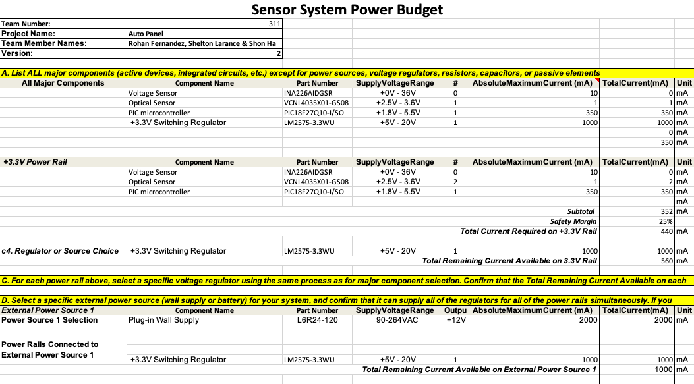

---
title:Power_Budget
---

For the Optical Sensor the absolute maximum current that the optical sensor can handle would be 200mA. However, this is for a specific mode where the proximity sensor and gesture control are active. Since I am utilizing the opticcal sensor solely for detecting the brightest light source, I would need a max of 0.3mA for the sensor to function properly. This leaves plenty of room for improvements and future proofing for later use. The power budget has also helped give me an estimate on the power needs for my system and showed how I can future proof my system. 
