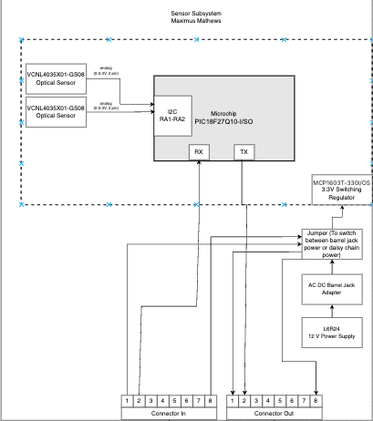
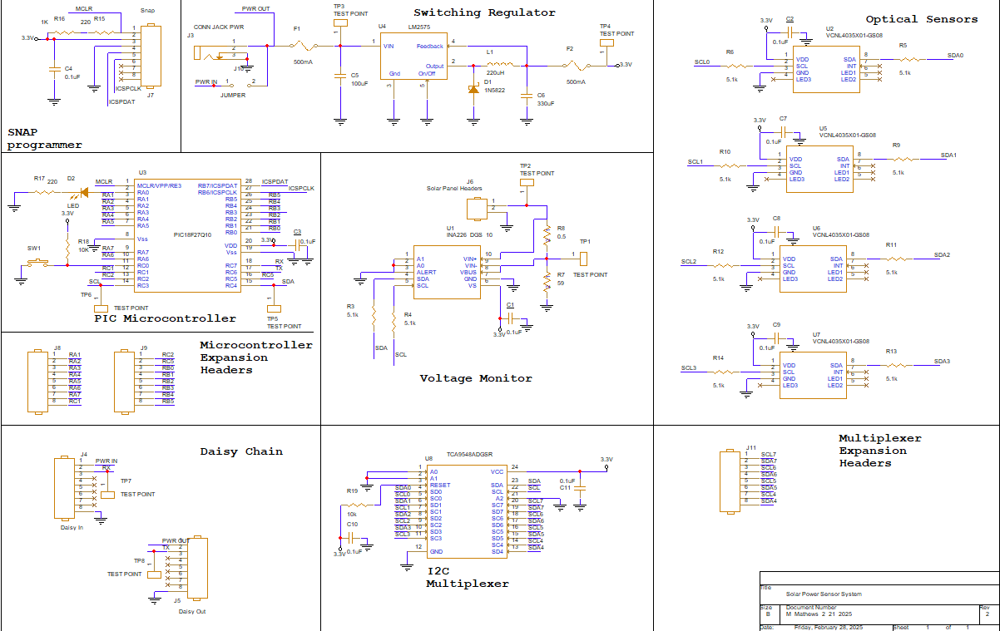

title: Charts
---
## Individual Block Diagram

# Decision Process

I removed several sensors due to time constraints and some issues with the voltage sensor. Furthermore, the optical sensors were upgraded to thier daughter board versions to futher help with the time constraints. This block diagram meets our product requirement as it incorporates aspects of serial communication and helps inspire STEAM based innovation for K-12 students.

## Sensor System Schematic

<a href="https://github.com/MaximusMathews/mmathe26.github.io/blob/main/docs/Sensor_System_Updated.pdf?raw=true" title="Schematic PDF" download >Schematic PDF</a>
<a href="https://github.com/MaximusMathews/mmathe26.github.io/blob/main/docs/Projects.zip?raw=true" title="Schematic Zip File" download >Schematic Zip File</a>

## PCB Design

**Sensor**

**Motor**

**HMI**

**MQTT**

## Schematic Functionality & Design Process

**Functionality**
The sensor system uses I2C serial communication to get the data from the sensors and send them through UART serial communication to the motor subsystem. This schematic meets our product requirement as it incorporates aspects of serial communication and helps inspire STEAM based innovation for K-12 students.

**Design Process**
The design process of our team was to incorporate serial communication and demonstrate STEAM components, while also reducing time consumption. We prioritized reliability and time constraints rather than funcitonality. This allowed for the quicker debugging of our circuit and helped solve several bugs with our design. 

**Version 2.0***
Something that would be improved in my schematic would be the removal of the multiplexer and incorporating a new sensor with a changable address. Furthermore, some bugs would be fixed from the original schematic, such as the proper implementation of pull-up resistors. These components should be improved as it will allow for more flexibility to my design and help me better debug any issues that may occur. 
